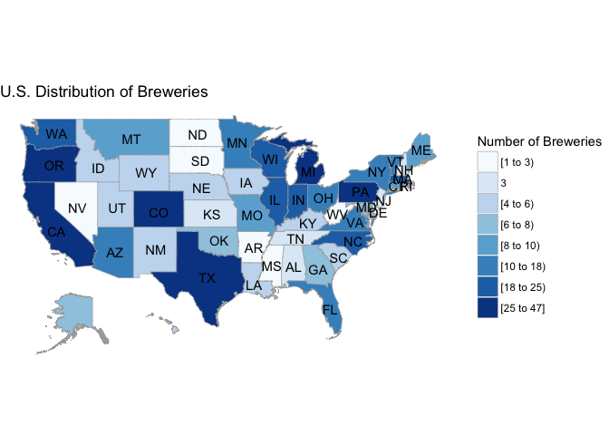

# U.S. Beer Brewery Assessment
Eric McCandless, Jordan Kassof  
October 5, 2017  

## Introduction

Market research about U.S. beers and breweries. Etc.

#### Question 1: Which states have the most breweries?


```r
source('./analysis/Breweries_Per_State.R')

#install.packages("choroplethr")
#install.packages("choroplethrMaps")
library(choroplethr)
map_data <- State_Counts
names(map_data) <- c("region.abb", "value")
map_data$region <- tolower(state.name[match(map_data$region.abb,state.abb)])
map_data$region[is.na(map_data$region)] <- "district of columbia"
state_choropleth(map_data,
                 title = "U.S. Distribution of Breweries",
                 legend = "Number of Breweries",
                 num_colors = 8)
```



```r
knitr::kable(cbind(State_Counts[1:26, ], rbind(State_Counts[27:51, ], c("", ""))))
```


State    Breweries  State   Breweries 
------  ----------  ------  ----------
AK               7  MT      9         
AL               3  NC      19        
AR               2  ND      1         
AZ              11  NE      5         
CA              39  NH      3         
CO              47  NJ      3         
CT               8  NM      4         
DC               1  NV      2         
DE               2  NY      16        
FL              15  OH      15        
GA               7  OK      6         
HI               4  OR      29        
IA               5  PA      25        
ID               5  RI      5         
IL              18  SC      4         
IN              22  SD      1         
KS               3  TN      3         
KY               4  TX      28        
LA               5  UT      4         
MA              23  VA      16        
MD               7  VT      10        
ME               9  WA      23        
MI              32  WI      20        
MN              12  WV      1         
MO               9  WY      4         
MS               2                    


#### Question 2

#### Question 3

#### Question 4

#### Question 5

#### Question 6

#### Question 7
