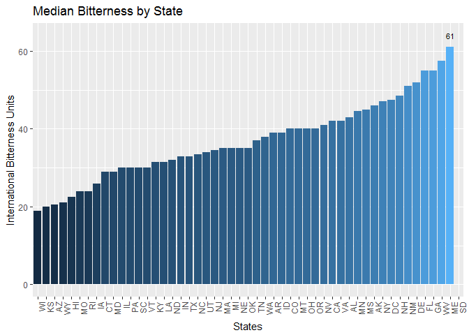
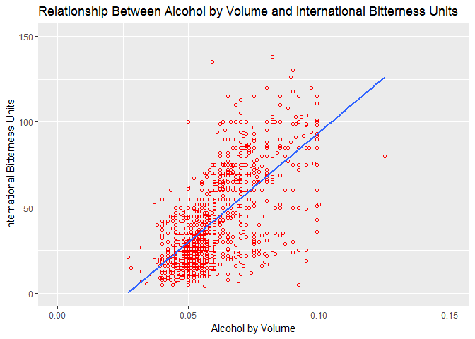

# U.S. Beer Brewery Assessment
Jordan Kassof, Eric McCandless (JKEM Market Research)  
October 5, 2017  

## Introduction/Background

Beers, Inc. has contracted with JKEM Market Research to assess the U.S. landscape of breweries and craft beer content.  Specifically, Beers, Inc. has asked JKEM to provide the answers to a few specific questions.  

- How many breweries are present in each state?  
- Analyze median alcohol content and bitterness by state
- Which state has the maximum alcoholic beer?  
- Which state has the most bitter beer? 
- Is there a relationship between alcohol content and bitterness?

In addition to providing these answers, JKEM will also provide bar charts, summary statistics, and scatterplots to show further insights. 


## Sources  


JKEM Market Research used data from Tibbett's Beer Lovers' Association to conduct this analysis.  Data files used in this analysis:  

- Beers.csv  
- Breweries.csv  


## Additional Information


Additional detailed information about this assessment can be found in the README file within the repository.  


## Analysis/Findings

### How many breweries are present in each state?

The purpose of the following code is to get a count of breweries for each state. That is handled inside the "Q1_Brewery_Per_State.R." From there we map the state abbreviations to state names, and produce a choropleth map to visually display the results. Last, we print a display table of the exact counts for each state.

```r
# Source brewery by state script, see script for details
source('./analysis/Q1_Brewery_Per_State.R')

# Use the state_choropleth function from the choroplethr package to create a 
# display map of brewery count by state
state_choropleth(map_data,
                 title = "U.S. Distribution of Breweries",
                 legend = "Number of Breweries",
                 num_colors = 8)
```


```r
# Use the kable function to print out display quality table to the report
knitr::kable(cbind(State_Counts[1:26, ], rbind(State_Counts[27:51, ], c("", ""))))
```


State    Breweries  State   Breweries 
------  ----------  ------  ----------
AK               7  MT      9         
AL               3  NC      19        
AR               2  ND      1         
AZ              11  NE      5         
CA              39  NH      3         
CO              47  NJ      3         
CT               8  NM      4         
DC               1  NV      2         
DE               2  NY      16        
FL              15  OH      15        
GA               7  OK      6         
HI               4  OR      29        
IA               5  PA      25        
ID               5  RI      5         
IL              18  SC      4         
IN              22  SD      1         
KS               3  TN      3         
KY               4  TX      28        
LA               5  UT      4         
MA              23  VA      16        
MD               7  VT      10        
ME               9  WA      23        
MI              32  WI      20        
MN              12  WV      1         
MO               9  WY      4         
MS               2                    


#### Key insights:  
- Colorado (47), California (39), and Michigan (32) have the most breweries
- Other top states with 25+ breweries, include Oregon (29), Texas (28), and Pennsylvania (25)  


### Merging beers and breweries data

The purpose of the following r code is to merge the Beers.csv data set that has AVB (Alcohol by Volume of Beer) by beer with the Breweries.csv dataset that has beers by state.  The new merged file is called Merged_Data.csv.  We also ran the top 6 records and bottom 6 records to check success of merge.


```r
# Source merging script, see script for details
source('./analysis/Q2_Merge.R')
# View top 6 rows of merged data
head(All_Data, 6)
```

```
##   Brewery_id        Name.x Beer_ID   ABV IBU
## 1          1  Get Together    2692 0.045  50
## 2          1 Maggie's Leap    2691 0.049  26
## 3          1    Wall's End    2690 0.048  19
## 4          1       Pumpion    2689 0.060  38
## 5          1    Stronghold    2688 0.060  25
## 6          1   Parapet ESB    2687 0.056  47
##                                 Style Ounces             Name.y
## 1                        American IPA     16 NorthGate Brewing 
## 2                  Milk / Sweet Stout     16 NorthGate Brewing 
## 3                   English Brown Ale     16 NorthGate Brewing 
## 4                         Pumpkin Ale     16 NorthGate Brewing 
## 5                     American Porter     16 NorthGate Brewing 
## 6 Extra Special / Strong Bitter (ESB)     16 NorthGate Brewing 
##          City State
## 1 Minneapolis    MN
## 2 Minneapolis    MN
## 3 Minneapolis    MN
## 4 Minneapolis    MN
## 5 Minneapolis    MN
## 6 Minneapolis    MN
```

```r
# View bottom 6 rows of merged data
tail(All_Data, 6)
```

```
##      Brewery_id                    Name.x Beer_ID   ABV IBU
## 2405        556             Pilsner Ukiah      98 0.055  NA
## 2406        557  Heinnieweisse Weissebier      52 0.049  NA
## 2407        557           Snapperhead IPA      51 0.068  NA
## 2408        557         Moo Thunder Stout      50 0.049  NA
## 2409        557         Porkslap Pale Ale      49 0.043  NA
## 2410        558 Urban Wilderness Pale Ale      30 0.049  NA
##                        Style Ounces                        Name.y
## 2405         German Pilsener     12         Ukiah Brewing Company
## 2406              Hefeweizen     12       Butternuts Beer and Ale
## 2407            American IPA     12       Butternuts Beer and Ale
## 2408      Milk / Sweet Stout     12       Butternuts Beer and Ale
## 2409 American Pale Ale (APA)     12       Butternuts Beer and Ale
## 2410        English Pale Ale     12 Sleeping Lady Brewing Company
##               City State
## 2405         Ukiah    CA
## 2406 Garrattsville    NY
## 2407 Garrattsville    NY
## 2408 Garrattsville    NY
## 2409 Garrattsville    NY
## 2410     Anchorage    AK
```


#### Key insights:
- The output show that the the two data sets are successfully merged into Merged_Data.csv. 


The purpose of the following r code is to determine the number of NAs in each column.


```r
# Use sapply to get a count of NAs for each column in the merged All_Data object
sapply(All_Data, function(x) sum(is.na(x)))    
```

```
## Brewery_id     Name.x    Beer_ID        ABV        IBU      Style 
##          0          0          0         62       1005          0 
##     Ounces     Name.y       City      State 
##          0          0          0          0
```


#### Key insights:
- The ABV (Alcohol by Volume) column has 62 NAs and the IBU (International Bitterness Units) column has 1,005 NAs. No other column has NAs.

### Calculating median ABV and displaying in barchart

The purpose of the following code was to calculate the median of alcohol by volume (ABV) for each state and show a bar chart highlighting data: 


```r
# Source file to calc median IBU and ABV, see script for details
source("./analysis/Q4_Med_IBU_ABV.R")

# Load libraries for plotting
library(ggplot2)
library(forcats)

# Create ggplot with medians in ascending order, with a label on the maximum ABV
ggplot(meds_by_state, aes(x = fct_reorder(State, ABV_Medians))) +
  geom_col(aes(y = ABV_Medians, fill = ABV_Medians)) +
  annotate("text", x = max_state_abv$State[1], y = max_state_abv$ABV_Medians[1] + max_state_abv$ABV_Medians[1] *.05, label = max_state_abv$ABV_Medians[1],  size = 3) +
  xlab("States") +
  ylab("Alcohol by Volume") +
  ggtitle("Median ABV by State") +
  theme(
    axis.text.x = element_text(angle = 90, hjust = 1),
    legend.position = 'none'
  )
```


```r
# Print out the state(s) with maximum ABV
max_state_abv
```

```
## # A tibble: 2 x 2
##    State ABV_Medians
##   <fctr>       <dbl>
## 1     DC      0.0625
## 2     KY      0.0625
```


#### Key insights, include:  
- Analysis of median ABV shows Washington D.C. and Kentucky tied for highest with ABV of 0.0625.


### Calculating median IBU and displaying in barchart


```r
# Create ggplot with medians in ascending order, with a label on the maximum IBU
ggplot(meds_by_state, aes(x = fct_reorder(State, IBU_Medians))) +
  geom_col(aes(y = IBU_Medians, fill = IBU_Medians)) +
  annotate("text", x = max_state_ibu$State[1], y = max_state_ibu$IBU_Medians[1] + max_state_ibu$IBU_Medians[1] *.05, label = max_state_ibu$IBU_Medians[1], size = 3) +
  xlab("States") +
  ylab("International Bitterness Units") +
  ggtitle("Median Bitterness by State") +
  theme(
    axis.text.x = element_text(angle = 90, hjust = 1),
    legend.position = 'none'
  )
```



```r
# Print out the state(s) with maximum ABV
max_state_ibu
```

```
## # A tibble: 1 x 2
##    State IBU_Medians
##   <fctr>       <dbl>
## 1     ME          61
```

#### Key insights, include:  
- Analysis of median IBU shows Maine with highest with IBU of 61.


### Which states have maximum alcoholic beer (ABV) and maximum bitterness beer (IBU)?


```r
library(dplyr)
# Use dplyr pipeline to get highest ABV value(s), then select state(s)
All_Data       %>%
  top_n(1,ABV) %>%
  select(State)
```

```
##   State
## 1    CO
```

```r
# Use dplyr pipeline to get highest IBU value(s), then select state(s)
All_Data       %>%
  top_n(1,IBU) %>%
  select(State)
```

```
##   State
## 1    OR
```

#### Key insights, include:
- Coldorado has the most alcoholic beer  
- Oregon has the most bitter beer  


### Summary statistics for all beer's alcohol content (ABV)


```r
# Concatenate standard deviation calculation with standard summary statistics
c(StDev = sd(All_Data$ABV, na.rm = TRUE), summary(All_Data$ABV))
```

```
##       StDev        Min.     1st Qu.      Median        Mean     3rd Qu. 
##  0.01354173  0.00100000  0.05000000  0.05600000  0.05977342  0.06700000 
##        Max.        NA's 
##  0.12800000 62.00000000
```

#### Key insights, include:
- The range of ABV is [0.001, 0.128]
- The median ABV is 0.056
- The mean ABV is 0.059, meaning the data are skewed slightly to the right


### Relationship between alcohol content and bitterness


```r
# Create ggplot of ABV vs IBU, add a line of best fit to easily detect any relationship
ggplot(All_Data, aes(x=ABV, y=IBU)) +
    ggtitle('Relationship Between Alcohol by Volume and International Bitterness Units') +
    labs(y= "International Bitterness Units", x = "Alcohol by Volume") +
    xlim(0, .15) +
    ylim(0, 150) +
    geom_point(shape=1, color='red') +    
    geom_smooth(method=lm, se=FALSE)    
```



#### Key Insights:

There is an apparent positive relationship between bitterness and alcohol content. This is to be expected because alcohol generally has a bitter taste.

## Conclusions

JKEM has conclused that the top three states with the most breweries are Colorado (47), California (39), and Michigan (32). While there are the most breweries present in those states, the states that have the highest median alcohol content are Kentucky and Washington DC, with a median ABV of 0.0625. Additionally, the states with the highest median bitterness score is Maine with median IBU of 61. The state with the maximum alcohol content beer is Coldorado, and the state with the most bitter beer is Oregon. Finally, there is an apparent positive relationship between bitterness and alcohol content as shown by the groupings and positive slope found in the scatterplot.
