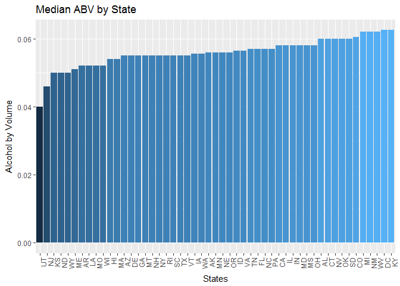

# U.S. Beer Brewery Assessment
Jordan Kassof, Eric McCandless (JKEM Market Research)  
October 5, 2017  

$~$

## Introduction/Background

$~$

### Beers, Inc. has contracted with JKEM Market Research to assess the U.S. landscape of breweries and craft beer content.  Specifically, Beers, Inc. has asked JKEM to provide the answers to a few specific questions.  
#### - How many breweries are present in each state?
#### - Which state has the maximum alcoholic beer?
#### - Which state has the most bitter beer?   

### In addition to providing these answers, JKEM will also provide bar charts, summary statistics, and scatterplots to show further insights.  

$~$

## Sources

$~$

### JKEM Market Research used data from Tibbett's Beer Lovers' Association to conduct this analysis.  Data files obtained include:
#### - Beers.csv
#### - Breweries.csv

$~$

## Additional Information

$~$

### Additional detailed information about this assessment can be found in the README file within the repository.  

$~$

## Analysis/Findings

$~$

### How many breweries are present in each state?

$~$

#### The purpose of the following code is to create a map and table that show how many breweries are present by state.  


```r
source('./analysis/Q1_Brewery_Per_State.R')

#install.packages("choroplethr")
#install.packages("choroplethrMaps")
library(choroplethr)
map_data <- State_Counts
names(map_data) <- c("region.abb", "value")
map_data$region <- tolower(state.name[match(map_data$region.abb,state.abb)])
map_data$region[is.na(map_data$region)] <- "district of columbia"
state_choropleth(map_data,
                 title = "U.S. Distribution of Breweries",
                 legend = "Number of Breweries",
                 num_colors = 8)
```


```r
knitr::kable(cbind(State_Counts[1:26, ], rbind(State_Counts[27:51, ], c("", ""))))
```


State    Breweries  State   Breweries 
------  ----------  ------  ----------
AK               7  MT      9         
AL               3  NC      19        
AR               2  ND      1         
AZ              11  NE      5         
CA              39  NH      3         
CO              47  NJ      3         
CT               8  NM      4         
DC               1  NV      2         
DE               2  NY      16        
FL              15  OH      15        
GA               7  OK      6         
HI               4  OR      29        
IA               5  PA      25        
ID               5  RI      5         
IL              18  SC      4         
IN              22  SD      1         
KS               3  TN      3         
KY               4  TX      28        
LA               5  UT      4         
MA              23  VA      16        
MD               7  VT      10        
ME               9  WA      23        
MI              32  WI      20        
MN              12  WV      1         
MO               9  WY      4         
MS               2                    

$~$

#### Key insights:
##### - Colorado (47), California (39), and Michigan (32) have the most breweries.
##### - Other top states with 25+ breweries, include Oregon (29), Texas (28), and Pennsylvania (25).

$~$

### Which state has the maximum alcoholic beer?

$~$

#### The purpose of the following r code is to merge the Beers.csv data set that has AVB (Alcohol by Volume of Beer) by beer with the Breweries.csv dataset that has beers by state.  The new merged file is called Merged_Data.csv.  We also ran the top 6 records and bottom 6 records to check success of merge.


```r
source('./analysis/Q2_Merge.R')
head(All_Data, 6)
```

```
##   Brewery_id        Name.x Beer_ID   ABV IBU
## 1          1  Get Together    2692 0.045  50
## 2          1 Maggie's Leap    2691 0.049  26
## 3          1    Wall's End    2690 0.048  19
## 4          1       Pumpion    2689 0.060  38
## 5          1    Stronghold    2688 0.060  25
## 6          1   Parapet ESB    2687 0.056  47
##                                 Style Ounces             Name.y
## 1                        American IPA     16 NorthGate Brewing 
## 2                  Milk / Sweet Stout     16 NorthGate Brewing 
## 3                   English Brown Ale     16 NorthGate Brewing 
## 4                         Pumpkin Ale     16 NorthGate Brewing 
## 5                     American Porter     16 NorthGate Brewing 
## 6 Extra Special / Strong Bitter (ESB)     16 NorthGate Brewing 
##          City State
## 1 Minneapolis    MN
## 2 Minneapolis    MN
## 3 Minneapolis    MN
## 4 Minneapolis    MN
## 5 Minneapolis    MN
## 6 Minneapolis    MN
```

```r
tail(All_Data, 6)
```

```
##      Brewery_id                    Name.x Beer_ID   ABV IBU
## 2405        556             Pilsner Ukiah      98 0.055  NA
## 2406        557  Heinnieweisse Weissebier      52 0.049  NA
## 2407        557           Snapperhead IPA      51 0.068  NA
## 2408        557         Moo Thunder Stout      50 0.049  NA
## 2409        557         Porkslap Pale Ale      49 0.043  NA
## 2410        558 Urban Wilderness Pale Ale      30 0.049  NA
##                        Style Ounces                        Name.y
## 2405         German Pilsener     12         Ukiah Brewing Company
## 2406              Hefeweizen     12       Butternuts Beer and Ale
## 2407            American IPA     12       Butternuts Beer and Ale
## 2408      Milk / Sweet Stout     12       Butternuts Beer and Ale
## 2409 American Pale Ale (APA)     12       Butternuts Beer and Ale
## 2410        English Pale Ale     12 Sleeping Lady Brewing Company
##               City State
## 2405         Ukiah    CA
## 2406 Garrattsville    NY
## 2407 Garrattsville    NY
## 2408 Garrattsville    NY
## 2409 Garrattsville    NY
## 2410     Anchorage    AK
```

$~$

#### Key insights:
##### - The output show that the the two data sets are successfully merged into Merged_Data.csv.

$~$

#### The purpose of the following r code is to determine the number of NAs in each column.


```r
sapply(All_Data, function(x) sum(is.na(x)))    
```

```
## Brewery_id     Name.x    Beer_ID        ABV        IBU      Style 
##          0          0          0         62       1005          0 
##     Ounces     Name.y       City      State 
##          0          0          0          0
```

$~$

#### Key insights:
##### - The ABV column has 62 NAs and the IBU column has 1,005 NAs. No other column has NAs.

$~$

#### The purpose of the following code was to calculate the median of alcohol by volume (ABV) for each state and show a bar chart highlighting data: 


```r
source("./analysis/Q4_Med_IBU_ABV.R")

library(ggplot2)
library(forcats)

ggplot(meds_by_state, aes(x = fct_reorder(State, ABV_Medians))) +
  geom_col(aes(y = ABV_Medians, fill = ABV_Medians)) +
  xlab("States") +
  ylab("Alcohol by Volume") +
  ggtitle("Median ABV by State") +
  theme(
    axis.text.x = element_text(angle = 90, hjust = 1),
    legend.position = 'none'
  )
```



# JORDAN - WE SHOULD AD VALUES TO BAR GRAPHS.  

$~$

#### Key insights, include:
#### - Colorado (47), California (39), and Michigan (32) have the most breweries.
#### - Other top states with 25+ breweries, include Oregon (29), Texas (28), and Pennsylvania (25).

$~$

### Which state has the most bitter beer?  

ggplot(meds_by_state, aes(x = fct_reorder(State, IBU_Medians))) +
  geom_col(aes(y = IBU_Medians, fill = IBU_Medians)) +
  xlab("States") +
  ylab("International Bitterness Units") +
  ggtitle("Median Bitterness by State") +
  theme(
    axis.text.x = element_text(angle = 90, hjust = 1),
    legend.position = 'none'
  )
```


#### Question 5

#### Question 6

#### Question 7

### Conclusion
